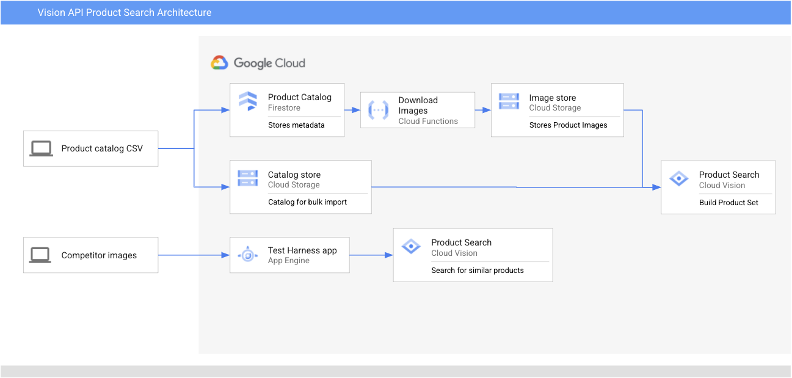

# Google Cloud Platform Vision API Product Search Demo

## Introduction

This repo shows an end-to-end example on how to use the [Vision API Product Search](https://cloud.google.com/vision/product-search/docs).

This feature of Vision API is part of [Google Cloud for retail](https://cloud.google.com/solutions/retail). A retailer can upload their product catalog, which includes images of their products. Customers can then perform image searches on this catalog, and the solution will provide the user with a list of similar products with similarity scores.

Watch [this video](https://www.youtube.com/watch?v=6PLaVc0rc6o&feature=emb_logo&autoplay=1) to see how IKEA uses this solution to enhance their customer experience, so that customers can use a mobile app to interactively construct their shopping list, simply by taking photos of products in the showroom!

In this example, we are using an [Open Data Set](https://github.com/BestBuyAPIs/open-data-set) from Best Buy. There has been some pre-processing to convert the original data set into a CSV format that is usable to Vision API. You can inspect this datain the [data](./data) subdirectory.

This data set contains more than 50,000 items in Best Buy's catalogue. We will be loading the images referenced in this dataset into our machine learning model in order to demonstrate this solution's capabilities.

## Architecture

There are three main components to this solution:

### Image downloader

Since Vision API Product Search requires images to be stored in a Google Cloud Storage bucket, this part of the solution consists of a Cloud Firestore collection that contains the product catalog. Each document in the collection will contain important information for each catalog item including its id, production description, as well as a URL to the product image. 

Whenever a new document is added to the collection, a Cloud Function is triggered, which will download the product image from the URL listed in the document, and then upload this image into a Cloud Storage bucket. The URI of the image is also written back into the document in Firestore.

### Bulk Import CSV

This will be a series of CSV files that contain a Product Set that needs to be uploaded into Vision API Product Search. The CSV file is broken into separate files because the bulk loading functionality currently only supports CSV files of up to 20,000 rows. These CSV files will also need to be uploaded into a Google Cloud Storage bucket.

### Test Harness Application

This component is optional, but this is a nice to have for this demo so it becomes easy to demonstrate the capabilities through this application. This is a Python application hosted on App Engine Flex. Credit goes to the original author and the original GitHub repo is [here](https://github.com/zinjiggle/google-product-search-simple-ui).

## Installation

You will need an active Google Cloud Platform billing account and permissions to add projects to this billing account. Other than this all other prerequisites are satisfied through Cloud Shell. You can deploy this solution by clicking on the "Open in Cloud Shell" button above and follow the instructions!

